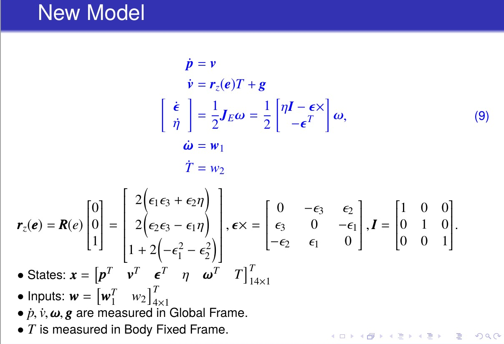
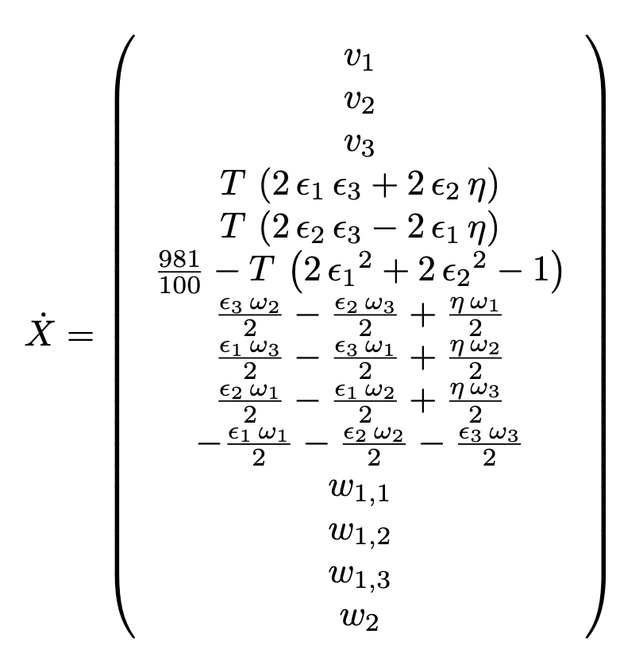
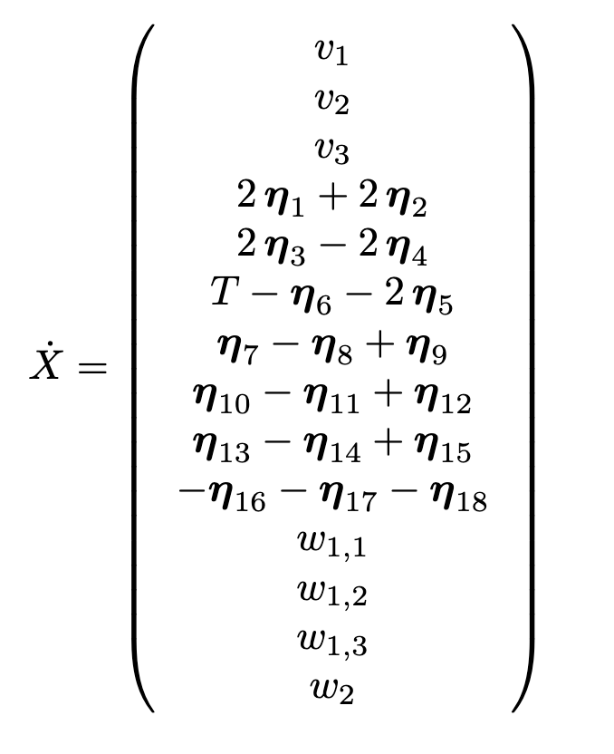
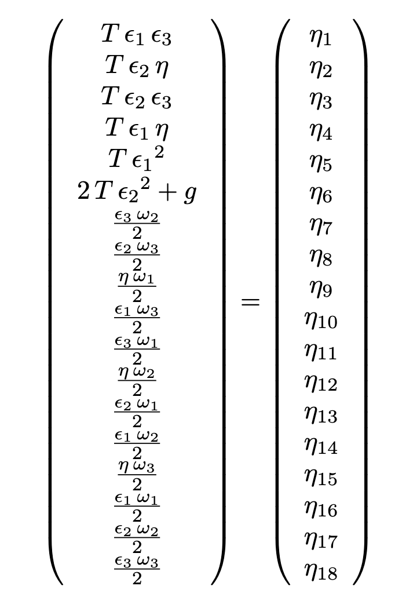
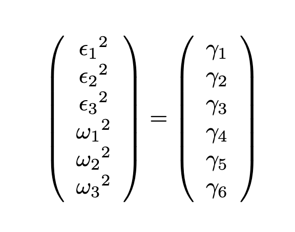

# Lifting Linearization of UAV

## Overview

|    Non-linear System     |    Linear System    |
| :----------------------: | :-----------------: |
|  |  |

### Auxiliary Parameters

|         Eta          |         Gamma          |
| :------------------: | :--------------------: |
|  |  |

## Run this code

-   run `init.m` only once
-   run `NewGenerateTrainingInput.m`

## Code Flow

1. NewGenerateTrainingInput
2. NewSysIdentification
3. NewModelValidation
4. plot_validation
