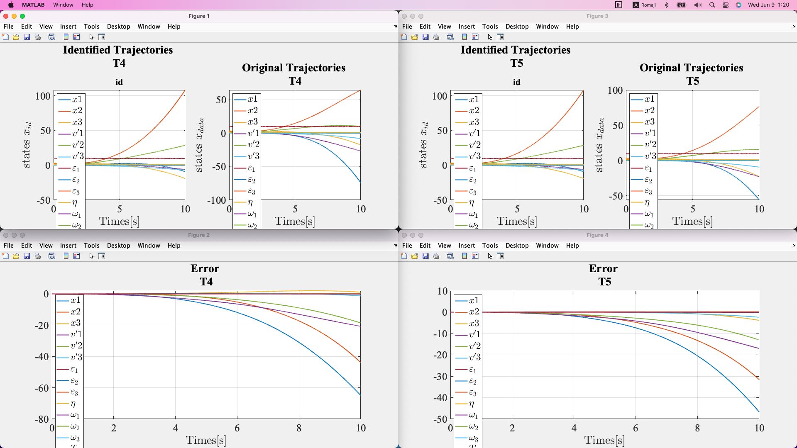
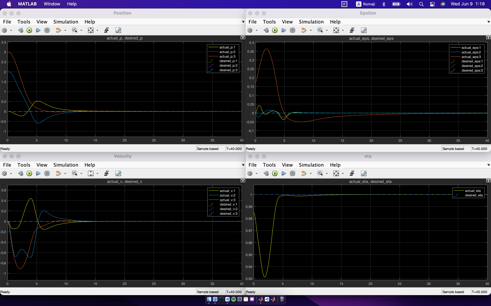

# Lifting Linearization of UAV

## Overview

|    Non-linear System     |    Linear System    |
| :----------------------: | :-----------------: |
|  |  |

### Auxiliary Parameters

|         Eta          |         Gamma          |
| :------------------: | :--------------------: |
|  |  |

## To Run this code

-   run `init.m` at the beginning
-   Modify `Parameters.m` to change initial conditions

## Code Flow

-   Linearization: `main1.m`
    1. GenerateTrainingInput
    2. SysIdentification
    3. ModelValidation
    4. plot_validation
-   LQR Controller Design: `main2.m`
    1. GenerateTrainingInput
    2. SysIdentification
    3. LQRController

## Folder Structure

-   Linearization: Code to generate linearized model
-   Sim: Simulink files
-   Controller: LQR and Servo Cotroller
-   Data: Best Model data

## Results:

-   Linearization:
    

-   LQR Controller:
    
